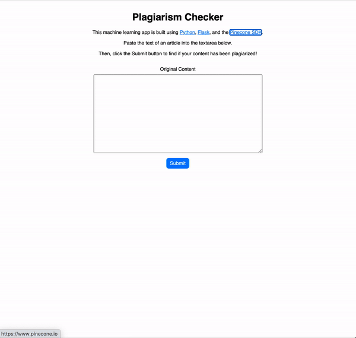

# Plagiarism Checker

This app is built using Python 3.9+, Flask 2.0+, and Pinecone. It performs a similarity search using the Pinecone SDK to find articles that contain the same or similar content as what's entered by the user.

Applying this to a real-world scenario, a professor might use a service like this to compare a student's essay with a database of other academic papers. Or as a writer, you might want to check if your content has been stolen and posted elsewhere under someone else's name.



## Running the app locally

Begin by cloning this git repo and navigating to the project directory.

Next, create a virtual environment and activate it:

```
python -m venv venv
. venv/bin/activate
```

Install dependencies by running:

```
python -m pip install -r requirements.txt
```

Create an `.env` file and add your Pinecone API key:

```
PINECONE_API_KEY=your-key-here
```

Finally, to run the app on your machine, simply run this command from the terminal:

```
flask run
```

Or, to run the app in debug mode, add the `FLASK_ENV=development` environment variable before the command:

```
FLASK_ENV=development flask run
```

The app should now be running on http://127.0.0.1:5000 in your browser.

## Resources

Python, pyenv, and pip
- https://realpython.com/intro-to-pyenv/
- https://github.com/pyenv/pyenv
- https://github.com/pyenv/pyenv/blob/master/COMMANDS.md#pyenv-shell
- https://pip.pypa.io/en/latest/user_guide/#requirements-files
- https://www.twilio.com/blog/environment-variables-python

Flask
- https://flask.palletsprojects.com/en/2.0.x/installation/
- https://flask.palletsprojects.com/en/2.0.x/quickstart/
- https://flask.palletsprojects.com/en/2.0.x/tutorial/
- https://github.com/pallets/flask/tree/main/examples/tutorial
- https://flask.palletsprojects.com/en/2.0.x/api/#flask.Request

Pinecone
- https://www.pinecone.io/docs/quickstart-python/
- https://www.pinecone.io/docs/examples/personalized-content-recommendations/
- https://docs.beta.pinecone.io/en/latest/python_client/manage.html

Dataset
- https://www.kaggle.com/snapcrack/all-the-news
